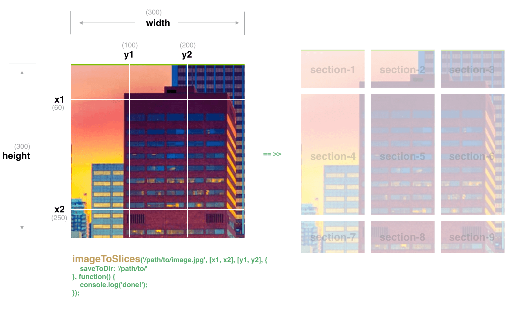

<p style="text-align: center">
    
</p>

# image-to-slices
> Node.js module for converting image into slices with the given reference lines. Backed by [Slices](https://github.com/superRaytin/slices) and [image-clipper](https://github.com/superRaytin/image-clipper).

[![NPM version][npm-image]][npm-url]
[![Downloads][downloads-image]][npm-url]
[![Bower version][bower-image]][bower-url]
[](https://travis-ci.org/superRaytin/image-to-slices)

[](https://npmjs.org/package/image-to-slices)

[npm-url]: https://npmjs.org/package/image-to-slices
[downloads-image]: http://img.shields.io/npm/dm/image-to-slices.svg
[npm-image]: http://img.shields.io/npm/v/image-to-slices.svg
[bower-url]:http://badge.fury.io/bo/image-to-slices
[bower-image]: https://badge.fury.io/bo/image-to-slices.svg

# Installation

### Node.js

```
npm install image-to-slices
```

> Since the server-side Node.js doesn't natively support Canvas, you'll need previously install [Cairo](http://cairographics.org/) which is depended by [node-canvas](https://github.com/Automattic/node-canvas), see [node-canvas#Installation](https://github.com/Automattic/node-canvas#installation) for detail.

```
npm install canvas
```

### Bower

```
bower install image-to-slices
```

# Quick Start

```js
var imageToSlices = require('image-to-slices');

var lineXArray = [100, 200];
var lineYArray = [100, 200];
var source = '/path/to/image.jpg'; // width: 300, height: 300

imageToSlices(source, lineXArray, lineYArray, {
    saveToDir: '/path/to/'
}, function() {
    console.log('the source image has been sliced into 9 sections!');
});
```

## Client-side (browser)

Simply download the latest minified version from the `dist/` folder. All APIs are available in a global object called `imageToSlices`.

```html
<script src="./dist/image-to-slices.js"></script>
```

```js
var imageToSlices = window.imageToSlices;
imageToSlices(source, lineXArray, lineYArray, {
    saveToDataUrl: true
}, function(dataUrlList) {
    console.log('sliced', dataUrlList);
});
```

You can also use `image-to-slices` via AMD or CMD.

## Command Line Interface

```
Usage: image-to-slices [options]

Options:

-h, --help                            output usage information
-v, --version                         output the version number
-s, --source <source file>            the path where the source image file
-x --lineX <x1,x2,...>                reference lines of the X axis
-y --lineY <y1,y2,...>                reference lines of the Y axis
-m --middleBoundaryMode <true|false>  enable middle boundary mode. Default is false
-o --output <output directory>        the directory where the image slices will be saved. Default is the current working directory of the process
```

Below is an example:

```
$ image-to-slices -s ./example/images/building.png -x 20,100 -y 100 -o ./example/
```

> Note that the Cli usage require node-canvas.

# Example

Online example: [http://leonshi.com/image-to-slices/](http://leonshi.com/image-to-slices/)

# API

```js
var imageToSlices = require('image-to-slices');
```

### imageToSlices(source, lineXArray, lineYArray [, options], callback)

- **source:** the path where the source image. Keep in mind that [origin policies](https://en.wikipedia.org/wiki/Same-origin_policy) apply to the image source, and you may not use cross-domain images without [CORS](https://en.wikipedia.org/wiki/Cross-origin_resource_sharing).
- **lineXArray:** reference lines of the X axis
- **lineYArray:** reference lines of the Y axis
- **options:** slice with some optional parameters, see [options](#options) for detail.
- **callback:** a function to be executed when slicing is complete.

### imageToSlices.configure(options)

Configure properties for global, properties changed by the `imageToSlices.configure` method will take effect for every instance created after the change.

```js
var imageToSlices = require('image-to-slices');
imageToSlices.configure({
    clipperOptions: {
        canvas: require('canvas')
    }
});
```

See [Options](#options) for available properties.

## Options

### saveToDir

The directory path where the image slices will be saved.

> Note that the path must be really exists.

### middleBoundaryMode

Either true or false, default is false.

If set to true, this will put spaces between each two X axis as parent-block,
the areas between the first Y axis and last Y axis will be children of the parent-block, and it will generate boundary data.

See [Slices#middleBoundaryMode](https://github.com/superRaytin/slices#middleboundarymode) for detail.

### clipperOptions

Configuration properties for the [image-clipper](https://github.com/superRaytin/image-clipper).

See [image-clipper#configure-options](https://github.com/superRaytin/image-clipper#clipperconfigureoptions) for available properties.

### saveToDataUrl

You should use either `saveToDir: true` or `saveToDataUrl: true`, default is false.

If set to true, then it will doesn't save the image slices as file but rather return data URI of the slices, and callback will be passed the result data URI.

Below is an example:

```js
ImageToSlices('path/to/image.jpg', [100], [100], {
  saveToDataUrl: true
}, function(dataUrlList) {
  console.log('sliced!', dataUrlList);
});
```

The `dataUrlList` returned will be like below:

```js
[
    { width: 100, height: 100, x: 0, y: 0, dataURI: 'data:image/jpeg;base64,....' },
    { width: 400, height: 100, x: 100, y: 0, dataURI: 'data:image/jpeg;base64,....' },
    { width: 100, height: 400, x: 0, y: 100, dataURI: 'data:image/jpeg;base64,....' },
    { width: 400, height: 400, x: 100, y: 100, dataURI: 'data:image/jpeg;base64,....' }
]
```

Below is another example which `middleBoundaryMode` is set to true:

```js
ImageToSlices('path/to/image.jpg', [100, 300], [100, 200, 300], {
  saveToDataUrl: true,
  middleBoundaryMode: true
}, function(dataUrlList) {
  console.log('sliced!', dataUrlList);
});
```

And the `dataUrlList` returned will be like below:

```js
[
    {
        "width": 500,
        "height": 100,
        "x": 0,
        "y": 0,
        dataURI: 'data:image/jpeg;base64,....',
        "children": [
            {
                "width": 100,
                "height": 100,
                "x": 100,
                "y": 0,
                "left": 0,
                "top": 0,
                "parentBlockIndex": 0,
                "index": 0,
                dataURI: 'data:image/jpeg;base64,....',
            },
            {
                "width": 100,
                "height": 100,
                "x": 200,
                "y": 0,
                "left": 100,
                "top": 0,
                "parentBlockIndex": 0,
                "index": 1,
                dataURI: 'data:image/jpeg;base64,....',
            }
        ],
        "boundary": {
            "leftTop": {
                "x": 100,
                "y": 0
            },
            "rightBottom": {
                "x": 300,
                "y": 100
            }
        }
    },
    ...
]
```

## Where is this library used?

If you are using this library in one of your projects, add it in this list :)

- [Puzzler](https://github.com/superRaytin/puzzler)

# Testing

```
npm test
```

# License

MIT, see the [LICENSE](/LICENSE) file for detail.
